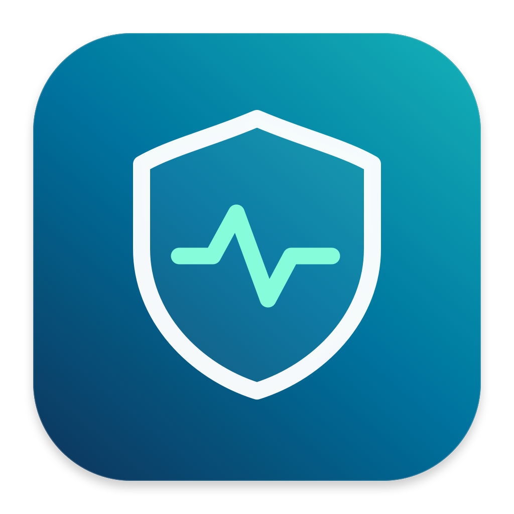

<h1 align="center">AI落地安全检测 · AI Exit Watch</h1>

观察 AI 请求的真实出口，发现偏离后提醒。macOS 菜单栏 / Windows 托盘工具。

<a href="https://github.com/52216108/ai-exit-watch/releases">下载预发布版</a> · <a href="PRIVACY.md">隐私说明</a> · <a href="CONTRIBUTING.md">参与贡献</a> · <a href="LICENSE">MIT</a>

直接检测 Claude 网页、Claude API 与 ChatGPT 网页请求的出口 IP、归属地、连通性和延迟。不需要 AI 账号或 API Key，不调用模型，不修改你的代理链。

> 本项目是独立工具，与 Anthropic / OpenAI 无隶属关系。检测正常不代表账号资格、模型访问或平台风控一定正常。首次公开版本为预发布版，Windows 桌面交互仍需更多实机试用。

## 下载与安装

从 [Releases](https://github.com/52216108/ai-exit-watch/releases) 下载对应系统的 ZIP。GitHub 自动生成的 Source code 压缩包是源码，不是可运行应用。

| 平台 | 下载文件 | 运行方式 |
| --- | --- | --- |
| macOS 13+，Apple Silicon / Intel | AI-Exit-Watch-版本-macOS-universal.zip | 解压后把应用拖入“应用程序”，再打开 |
| Windows 11，Intel / AMD x64 | AI-Exit-Watch-版本-Windows-x64.zip | 解压到固定目录，双击 AIExitWatch.exe，无需另装 .NET |

同页提供 SHA256SUMS.txt。下载后可核对：

    # macOS，使用对应 ZIP 文件名
    shasum -a 256 AI-Exit-Watch-0.3.1-macOS-universal.zip

    # Windows PowerShell
    Get-FileHash .\AI-Exit-Watch-0.3.1-Windows-x64.zip -Algorithm SHA256

macOS 包仅 ad-hoc 签名，未使用 Developer ID 或公证；Windows 包未做 Authenticode 签名。首次打开可能被系统提醒。先确认下载来源和校验值，再按系统提供的安全设置允许该应用；不要全局关闭系统安全防护。macOS 可参考 [Apple 官方步骤](https://support.apple.com/en-us/102445)。受企业策略限制的电脑请联系管理员。

从旧的私下分享版本升级：先关闭旧版登录启动并退出。公开版 macOS 应用标识已更新，通知权限和登录启动需要重新设置；本地数据目录保持一致，请避免同时运行旧版和新版。

## 开始使用

1. 保持原有代理软件正常运行，打开应用，等待第一轮结果。
2. 确认 Claude 网页、Claude API 和 ChatGPT 网页的出口均符合预期，再手动“确认正常基准”。
3. 开启通知，按需设置 60 / 120 / 300 / 600 秒间隔；一轮执行结束后再启动下一轮，不叠加检测。
4. 同一项异常连续两次才提醒，连续两次不再出现才报告恢复；数据缺失不会被误判为偏离已恢复。
5. macOS 点击菜单栏盾牌，Windows 双击右下角托盘盾牌打开。关闭窗口继续监测；明确退出或休眠期间不监测。

未设置基准时仍可提醒连接失败、归属地未知和高延迟，但不会显示“与基准一致”。应用不会自动把首次检测当成可信网络，也不会自动更新基准。

## 能检测什么

- **三个 AI 出口**：claude.ai、api.anthropic.com、chatgpt.com 的 HTTPS trace，要求有效 IP 与地区。
- **多出口对照**：ip.3322.net、checkip.amazonaws.com、Cloudflare 三个参考来源。不同目标 IP 不同可能是正常分流；参考项不参与 AI 基准告警。Google 出口未接入可靠来源。
- **中文归属地与情报**：国家、州 / 省、城市、ASN、运营商、时区；VPN、Proxy、Tor、机房、移动网络标签。可关闭查询，详情见 [隐私说明](PRIVACY.md)。
- **本机 IPv6**：只读查看网络接口与地址类别；macOS 另查看主网络服务设置。有无地址不能单独证明开关关闭、公网连通或浏览器无泄露。
- **Mihomo 链路**：可选只读观察“本机 → 前置节点 → 落地节点 → Claude API”。未捕获完整活动连接时显示未知。
- **固定出口保护**：导出供用户手动导入的 Clash Verge Rev 订阅扩展脚本，并检查规则是否匹配当前方案。

归属地是大致位置，不能确定街道或门牌。“情报库未标记”不等于住宅 IP、安全或平台认可。爬虫和滥用记录没有接入数据源；系统语言 / 时区不等于浏览器环境，差异本身不触发告警。

## 浏览器登录环境

本工具探测自身请求。浏览器、Claude Code 或其他客户端如果使用独立代理 / 按进程分流，路径可能不同；ChatGPT 网页结果不代表 OpenAI API / Codex 的出口。

在实际登录 Claude 的同一浏览器，通过应用入口打开 [Net.Coffee](https://ip.net.coffee/claude/)，检查 DNS、WebRTC、浏览器时区和语言等。网站仅在点击时访问，后台监测不依赖它。

登录前检查：**保持落地 IP 干净、关闭 IPv6、DNS 正常无泄露、关闭 WebRTC**。这是检查提醒，不代表应用已验证这些项目通过，也不构成平台风控保证。

## Mihomo 与固定出口保护

无需为了本工具修改代理链、TUN、DNS 或节点。基础出口检测不要求使用 Mihomo。

- macOS：设置里“自动查找”当前用户的本地 Unix socket。
- Windows：设置里“查找管道”，确认属于当前代理实例后保存；常见名称为 verge-mihomo，新版本可能带用户标识。
- 无接口或无权限时，该功能显示未接入；本工具不会自动开启控制器或要求开放 TCP 端口。
- 链路观察是活动连接采样，不保证覆盖全部流量；对话中未捕获的链路保持未知。

“出口锁定”使用方式：

1. 读取固定节点，选择落地节点及 Claude / OpenAI 范围。
2. 导出 JS，先备份原订阅扩展脚本，再把完整 BEGIN / END 区块追加在末尾。更新时替换旧区块，不重复叠加。
3. 在 Clash Verge Rev 中手动保存、应用订阅，保持规则模式。
4. 重新打开 AI 页面 / 客户端以建立新连接，再点击“检查生效情况”。
5. 撤销时只移除该区块，再手动应用订阅。具体入口见 [官方扩展说明](https://www.clashverge.dev/guide/extend.html)。

脚本保留原 main 和原节点配置，对每个保护域名置顶“固定节点 + 相邻 REJECT”。固定链拨号失败不会改走其他出口；节点不支持 UDP 时也由 REJECT 阻止落入后续规则。节点缺失、重名、类型或前置关系改变时拒绝。自动切换组、循环链与未知链不能作为固定方案；代理集合节点不在最终 config.proxies 中时会保守拒绝。

Claude 范围：claude.ai、anthropic.com、claudeusercontent.com 及子域。
OpenAI 范围：chatgpt.com、openai.com、oaistatic.com、oaiusercontent.com 及子域，**包含 OpenAI API / Codex**。

**导出不等于生效。** 核验只反映当时读取的配置。规则只保护经过 Mihomo 规则模式且匹配域名的新连接，不是系统级断网开关；已有连接、绕过代理的 DNS / WebRTC / IPv6、未列出的域名和同名节点背后的出口 IP 变化不在保护范围。

## 数据与通知

本地保存设置、基准、最多 1,440 次样本和 500 条事件，不云同步：

- macOS：~/Library/Application Support/NetworkWatch/state.json
- Windows：%LOCALAPPDATA%\AIExitWatch\state.json

通知只显示摘要，IP 和节点名留在应用内。系统勿扰、屏幕共享和通知权限可能抑制横幅。文件损坏时保留原件，不静默覆盖。卸载不会自动删除历史；移除前先退出应用。不要把 state.json、代理配置或未脱敏截图提交到仓库。

## 从源码构建

macOS 需要完整 Xcode、Python 3：

    swift test
    bash scripts/build-app.sh --universal
    open "dist/AI落地安全检测.app"

如需从源码安装至当前用户应用目录，可执行 bash scripts/install-app.sh；它会构建、保留旧安装并注册新版应用。普通用户推荐使用 Release ZIP。

Windows 需要 .NET 10 SDK，测试另需 Node.js：

    dotnet run --project windows/WatchCore.Tests -c Release -- .build/windows-tests
    node windows/WatchCore.Tests/verify-lock.mjs .build/windows-tests
    pwsh windows/build.ps1

打包使用 Python 3：

    python3 scripts/package-release.py macos
    python3 scripts/package-release.py windows

输出位于 dist/packages。Windows 也可交叉编译，详见 [Windows 构建说明](windows/README.md)。

macOS 命令行单次真实检测：

    swift run network-watch-probe
    swift run network-watch-probe --no-geo
    swift run network-watch-probe --chain

若另外安装了 Mihomo，可运行隔离的真实回环测试：

    MIHOMO_TEST_BINARY=/path/to/mihomo swift test --filter ExitLockTests

测试自行启动临时内核、关闭 TUN / DNS，不接入当前用户代理。实际平台验证范围见 [验证说明](docs/verification.md)，桌面体验和网络可用性仍需各机器确认。

## 许可证与参与

项目采用 [MIT](LICENSE)，允许商业使用、修改和分发，须保留版权与许可声明。第三方运行库和服务保持各自条款，见 [第三方声明](THIRD_PARTY_NOTICES.md)。

欢迎通过 [Issues](https://github.com/52216108/ai-exit-watch/issues) 反馈脱敏后的问题。贡献前参阅 [CONTRIBUTING](CONTRIBUTING.md)，安全问题参阅 [SECURITY](SECURITY.md)。
